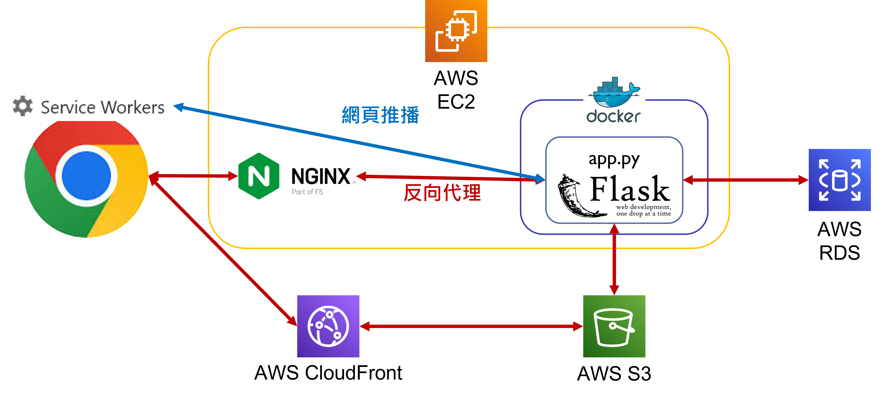

# stock_project 台灣股票資訊

## 網址
### https://yin888.info/

## 簡介
### 提供大盤及各股的基本資訊和基本的技術分析指標以協助判斷投資的股票標的，首頁提供前五權值股近3日的相關新聞。註冊會員系統並關注各股可以使用到價通知的功能，首頁也會顯示關注各股近3日的相關新聞。

## 功能
*  訪客
    *   移動平均線
        *   10日線
            ### 短期趨勢判斷。
        *   月線
            ### 中期趨勢判斷。
        *   年線
            ### 長期趨勢判斷。
    *   各股資訊
        *   本益比
            ### 股價和近4季收益的比例，用於衡量一家公司的價值。公司收益提供近10日的本益比。
        *   現金殖利率
            ### 近4季現金股利和股價的比例，投資的報酬率。提供近10日的現金殖利率。
        *   股價淨值比
            ### 股價和每股淨值的比例，用於衡量一家公司的價值。提供近10日的股價淨值比。
        *   近4季EPS
            ### 每股盈餘。提供歷年EPS。
        *   ROE(%)
            ### 股東權益報酬率，一家公司運用自有資本的獲利效率。提供歷年ROE。
*  會員
    *   各股關注
        *   到價通知
            *   email
                ### 當股價觸及目標股價，寄送email通知會員。(需驗證email)
            *   網頁推播
                ### 當股價觸及目標股價，網頁推播通知會員。(需訂閱推播通知)
        *   新聞
            ### 首頁呈現關注各股近3日的新聞。
    *   各股留言板
        ### 分享對於各股的看法。

## 網頁架構

## 使用工具

## 問題解決