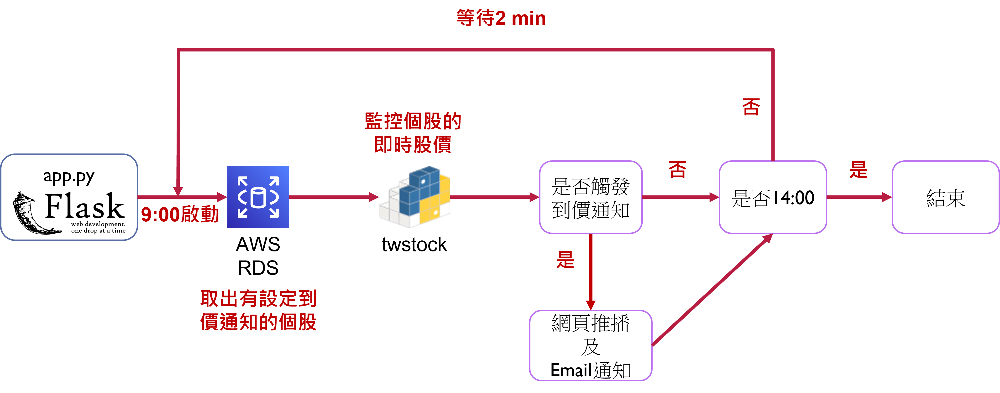

# stock_project 台灣股票資訊

## 網址
https://yin888.info/

## 簡介
提供大盤及個股的基本資訊和基本的技術分析指標以協助判斷投資的股票標的，首頁提供前五權值股近 3 日的相關新聞。註冊會員系統並關注個股可以使用到價通知的功能，首頁也會顯示關注個股近 3 日的相關新聞。

## 功能
*  訪客
    *   移動平均線
        *   10 日線
             短期趨勢判斷。
        *   月線
             中期趨勢判斷。
        *   年線
             長期趨勢判斷。
    *   個股資訊
        *   本益比
             股價和近 4 季收益的比例，用於衡量一家公司的價值。公司收益提供近 10 日的本益比。
        *   現金殖利率
             近 4 季現金股利和股價的比例，投資的報酬率。提供近 10 日的現金殖利率。
        *   股價淨值比
             股價和每股淨值的比例，用於衡量一家公司的價值。提供近 10 日的股價淨值比。
        *   近 4 季 EPS
             每股盈餘。提供歷年 EPS 。
        *   ROE ( % )
             股東權益報酬率，一家公司運用自有資本的獲利效率。提供歷年 ROE 。
*  會員
    *   個股關注
        *   到價通知
            *   email
                 當股價觸及目標股價，寄送 email 通知會員。(需驗證 email )
            *   網頁推播
                 當股價觸及目標股價，網頁推播通知會員。(需訂閱推播通知)
        *   新聞
             首頁呈現關注個股近3日的新聞。
    *   個股留言板
         分享對於個股的看法。

## 網頁架構

#### 資料獲取流程圖

#### 到價通知流程圖

## 使用工具
*   AWS
    *   EC2
     可擴展的運算容量，部署網頁應用程式。
    *   RDS
     雲端關聯式資料庫，此專案使用其中 MySQL 資料庫。
    *   S3
     雲端物件儲存，用於儲存會員圖片及數據量龐且須日更新的股價和新聞資料，避免浪費資料庫資源。
    *   CloudFront
     低延遲內容交付網路 ( CDN ) ，避免透過 api 拿取資料造成的網頁延遲。
*   Python
    *   flask
     開發網頁應用框架。
    *   FinMind
     提供台股的各方面資訊及新聞，此專案大多資訊由 FinMind 提供。 ( https://finmindtrade.com/ )
    *   twstock
     提供個股的即時股價資訊。 ( https://twstock.readthedocs.io/zh_TW/latest/ )
    *   jwt
     保存會員登入狀態、身分認證及挾帶非私密的資料。
    *   session
     暫存 email 的驗證碼。
    *   boto3
     AWS 開發套件，上傳資料至 AWS S3 。
    *   pandas
     資料操作分析， FinMind 回傳的資料為 DataFrame 結構。
    *   smtplib
     Simple Mail Transfer Protocol ( SMTP ) 寄送電子郵件。
    *   concurrent.futures
     Python 的平行處理模組，同時執行多個任務 ( tasks ) 。
    *   pywebpush
     Python 的網頁推播模組，將訊息由伺服器主動傳送至 service workers ，以完成網頁推播功能。
    *   flask_apscheduler
     Python 的排程模組，於每日9點啟動監控設定到價通知股票的即時股價、每日9點及18點啟動更新大盤資訊及每8小時啟動更新台股5大權值股相關新聞資訊。
    *   dotenv
     取用.env的資訊，避免洩漏私密資訊。
    *   mysql.connector.pooling
     使用連線池，有效利用資料庫資源。
    *   bs4
     網頁爬蟲，特定資料須透過網站取得，如 goodinfo 及台灣證交所。 ( https://goodinfo.tw/tw/index.asp / https://www.twse.com.tw/zh/ )
*   JavaScript
    *   TradingView
     提供各式金融圖表。 ( https://tw.tradingview.com/lightweight-charts/ )
    *   Service Workers
     瀏覽器後台運行的proccess，實作推播功能。
*   Others
    *   Docker
     輕量級的虛擬化技術，跨平台部屬專案。
    *   nginx
     網頁伺服器，此專案應用其反向代理 ( Reverse Proxy ) 的功能。
    *   git
     版本控管工具。

## 問題解決
### 發生問題：首頁讀取時間過久(約需15秒)
### 尋找真因：
*   大盤歷史股價及成交量數據量過大(透過api送出需求至回傳時間約需 1.5 秒)
*   個股新聞(透過api送出需求至回傳時間約需 1-3 秒不等，依個股新聞數量決定)
### 解決方案：
- [ ] Local storage
    * 將資料儲存至本機端。
    * 提升個人瀏覽器的存取速度。
    * 無法即時更新資料。
    * 容量僅約 5 MB。
- [X] AWS S3
    * 透過 AWS CloudFront 將資料緩存至全球各地的多個伺服器節點。
    * 提升所有requests的存取速度。
    * 即時更新資料。
- [x] 平行處理個股新聞的資料
    * 依個股數量需多次透過 api 取得不同個股的新聞資料，如僅使用單一執行緒的處理時間為 T1 + T2 + ... + Ti；使用多執行緒則為 Ti ( Ti為最費時的request )。

避免使用者等待讀取時間過久以及確保使用者能得到最新資訊，於每日的 9 點及 18 點自動更新大盤的股價資訊確保資料為最新的資訊；每 8 小時自動更新台股五大權值股的新聞。